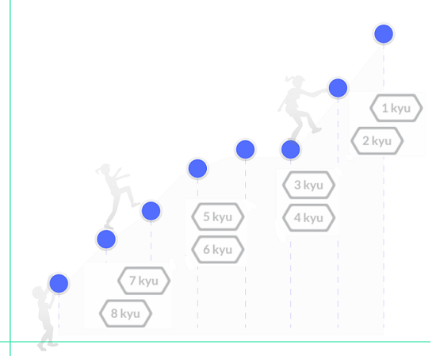

## 1. Contexto.

En los últimos años el Software Libre/Abierto ha pasado de ser un simple modelo de desarrollo de software a ser un elemento clave en las estrategias de desarrollo de empresas, instituciones, regiones e incluso países enteros como se comenta en el artículo [Software libre: investigación y desarrollo](http://www2.ati.es/novatica/2007/190/Nv190-3.pdf). Dado el papel predominante que juega, además, en el campo de la ciencia de datos, hemos querido investigar un poco más. Ya se publican periódicamente análisis relativos a los lenguajes de programación (como mencionamos en el apartado 6 de este documento), pero nuestro interés se centra más en el entorno no profesional. Es decir, queremos analizar los lenguajes de programación desde un punto de vista relativo al reto personal que suponen más que desde un punto de vista profesional.    
Es por eso que hemos elegido una página web llamada [Codewars](https://www.codewars.com/) en la que usuarios avanzados publican retos de programación completamente públicos, de libre acceso, con la intención de fomentar o desarrollar habilidades y competencias. A dichos retos se les denomina "katas". Y sobre esos ejercicios es sobre los que hemos aplicado nuestro *web scrapping*.

### Utilidades
* Obtener información sobre el interés que suscitan los diferentes lenguajes de programación en el mercado.
* Análisis estadístico descriptivo del sector del desarrollo del software.
* Comparativa entre rendimiento, potencia y evolución de los diferentes lenguajes de programación.
* Desde el punto de vista empresarial, acceso a información valiosa sobre perfiles expertos en los lenguajes de interés.

## 2. Definir un título para el dataset.

Katas (ejercicios de programación) y estadísticas asociadas.

## 3. Descripción del dataset.

El conjunto de datos recoge información sobre las katas de programación resueltas en la plataforma `CodeWars`, con diferentes lenguajes y niveles de dificultad. En total, consta de 6.932 registros en la fecha de recogida de información (18 de marzo de 2021). Cada uno de estos registros se corresponde a una única kata, para la que se obtienen 21 variables diferentes que se listan y detallan a continuación:

* **id_kata**: identificador único de la kata.
* **name**: nombre de la kata.
* **author**: autor de la kata.
* **author_profiles**: perfiles sociales (si existen) del autor de la kata.
* **tags**: tags de la kata.
* **kata_complexity**: complejidad de resolución de la kata; es un valor que va desde *8 kyu* (la más sencilla) a *4 dan* (la más compleja).
* **published**: fecha de publicación de la kata en la página web.
* **warriors_trained**: número de personas que han entrenado con la kata.
* **total_skips**: número de personas que han abandonado la kata sin resolverla.
* **total_code_submissions**: total de soluciones presentadas.
* **total_times_completed**: número de veces que la kata ha sido resuelta.
* **languages_completions**: número de veces que la kata ha sido resuelta por lenguaje de programación.
* **total_stars**: número de veces que se ha agregado la kata a favoritos.
* **positive_feedback**: Porcentaje de votos positivos sobre el total.
* **total_very_satisfied_votes**: Número de votantes muy positivos.
* **total_somewhat_satisfied_votes**: Número de votantes positivos.
* **total_not_satisfied_votes**: Número de votantes insatisfechos.
* **total_rank_assessments**: número de rangos que han participado en la kata.
* **average_assessed_rank**: rango medio de los que han entrenado con la kata.
* **highest_assessed_rank**: rango más elevado de los que han entrenado con la kata.
* **lowest_assessed_rank**: rango inferior de los que han entrenado con la kata.


## 4. Representación gráfica.

{width=350 heigth=350}
{width=250 heigth=250}

## 5. Contenido.

A la hora de seleccionar la página web de la que extraer la información, hemos aplicado las buenas prácticas recogidas en el material de la asignatura:


* Uso del fichero *robots.txt* para confirmar que el propietario de los datos permite el acceso a la información.
* Examen del sitio Web y su estructura para identificar la ubicación de la información que queremos obtener.
* Análisis del tamaño y tecnología de la página web para evaluar la cantidad total de información a recoger.
* Utilización de la libreria BeautifulSoup para evitar el parseado manual.
* No saturar de peticiones el servidor web, para lo que hemos establecido un tiempo de espera entre petición y petición.

Por otro lado, respecto a la información a recoger:


* El dataset incluye las katas resueltas que tienen el filtro *Approved*. 
* El número total de katas en esa categoría asciende a 6.932 en la fecha de obtención de la información (18 de marzo de 2021). 
* No se dispone de información sobre la fecha de ejecución de la kata, pero sí se conoce la fecha de publicación de esta. Teniendo en cuenta ese dato, el dataset contiene katas publicadas entre el mes de marzo de 2013 y el mes de marzo de 2021. 
* Además, para cada una de esas katas, se recogen 21 variables listadas en el apartado 3 de este documento.

En cuánto a la extracción del contenido, para la mayoría de las variables recogidas ha sido directa una vez ubicada la información. No obstante, ciertas columnas forman una lista variable de elementos, como puede pasar con las columnas **author_profiles**, **tags** y **languages_completions**. En estos casos se usa la siguiente notación:

```bash
author_profiles = [author_1_uri, author_2_uri]

tags = [tag_1, tag_2]

languages_completions = [(language_1, total_times_completed), (language_2, total_times_completed)]
```


## 6. Agradecimientos.

Los datos han sido obtenidos de la plataforma Codewars. Se trata de una comunidad web que nace como el esfuerzo colaborativo de usuarios que desinteresadamente aportan katas de entrenamiento, soluciones a las mismas y feedback constructivo. Este servicio ayuda a crecer profesionalmente a la comunidad de desarrolladores en su campo de conocimiento

Hemos encontrado otros análisis similares relativos a lenguajes de programación, por ejemplo el que publica [TIOBE Software](https://www.tiobe.com/tiobe-index/) mediante su **indicador de popularidad de lenguajes de programación** con periodicidad mensual, o la **Developer Survey** que publica anualmente [Stack Overflow](https://insights.stackoverflow.com/survey/2020)

## 7. Inspiración. 

El auge del del software libre en los últimos años es la base de partida de esta práctica. Analizando la información existente al respecto, encontramos los dos estudios relativos a lenguajes de programación mencionados anteriormente. Veamos los datos que se obtienen en ambos casos:

### 7.1 TIOBE index

El índice TIOBE analiza el número de veces que se menciona un lenguaje de programación en los 25 principales motores de búsqueda.
Para que un lenguaje de programación se considere como tal, debe tener un número de menciones igual o superior a 5.000, tener una entrada propia y superar el test de Turing.
Con los datos anteriores, se genera una clasificación por número de menciones y se compara con la misma clasificación del mes anterior, de forma que se obtiene no solo la posición absoluta de cada lenguaje en cuánto a popularidad, sino también su tendencia.

Más información respecto a como se calcula el índice TIOBE [aquí](https://www.tiobe.com/tiobe-index/programming-languages-definition/)

### 7.2 Stack Overflow

El informe de Stack Overflow es bastante más extenso que el anterior en cuanto a información obtenida. Se basa en una encuesta llevada a cabo entre los usuarios de la página web que el año pasado tuvo más de 65.000 respuestas. Recolecta información sobre cuatro campos principales:


* Desarrolladores: ubicación geográfica, tipos, experiencia, educación e información demográfica
* Tecnología: popularidad, entornos y herramientas de desarrollo, mejor pagadas, correlaciones, aprendizaje y resolución de problemas
* Trabajo: empleos, información de compañías, valores, búsqueda de trabajo, prioridades y salario.
* Comunidad: Uso del sitio, frecuencia de uso y propuestas de mejora.

### 7.3 Nuestra propuesta

Los estudios citados en el apartado anterior permiten conocer la evolucion temporal del uso de los lenguajes de programación en el primer caso y información muy interesante sobre el mundo del desarrollo del software en el segundo caso (aunque sesgada ya que se obtiene a partir de los usuarios de una página web en concreto). Creemos que nuestro dataset, sin ser tan ambicioso como los estudios anteriores puede aportar información interesante dando respuesta respuesta a las siguientes preguntas:

+ ¿Qué lenguajes de programación son los preferidos para competir, al margen del entorno profesional?
+ ¿Cual es el reparto porcentual de usuarios por lenguaje de programación combinando más de uno de ellos?
+ ¿Cómo se distribuyen los desarrolladores según la complejidad de las katas?
+ ¿Qué katas resultan más atractivas y porqué?

Soy una empresa de desarrollo de software o un profesional en RRHH: 

+ ¿Qué perfiles son los más completos en cuánto a conocimientos para la contratación?
+ ¿...más persistentes ante los problemas?
+ ¿...más creativos en las resoluciones de estos?
+ Una vez tengo identificados los perfiles que me interesan, ¿puedo obtener su información profesional en sus perfiles de RRSS?
  


## 8. Licencia.

Se ha decidido hacer uso de la licencia **GPLv3** recomendado por la [Free Software Foundation. (FSF)](https://www.gnu.org/licenses/license-recommendations.html). Nos interesa especialmente por las libertades que la misma ofrece a los usuarios. Se permite su distribución, se reconoce el autor de la obra, se permite editar el código fuente, incluso lucrarse economicamente con el mismo. No obstante, no se permite privatizar el software con una licencia que altere las libertades anteriormente expuestas.

## 9. Código.

El código utilizado para la extracción de la información requerida mediante Web Scrapping se puede acceder mediante la siguiente [URL](https://github.com/svilame/PRAC1).

## 10. Dataset.

El dataset se ha publicado en formato CSV en Zenodo [DOI. 10.5281/zenodo.4664585](10.5281/zenodo.4664585) con la siguiente descripción:

*The dataset contains information extracted from the website “Codewars” about different programming exercises created with the intention of fostering or developing abilities and competences. Said exercises are called “katas”. Our dataset collects information from recently solved katas and their statistics, applying the "Approved" filter. The total number of katas in that category amounts to 6.932 (18th March, 2021). Information about the date of execution is not available beyond the previously mentioned filter, but the date of publication of the kata is known. Taking this factor into account, the dataset contains katas published between March 2013 and March 2021.* 

Además se puede leer en la carpeta **data** bajo el siguiente [enlace](https://raw.githubusercontent.com/svilame/PRAC1/main/data/katas.csv).

## Tabla contribuciones

**Contribuciones** |**Firma** |
----------------------| ----------------------|
*Investigación Previa* | Eleazar Morales Díaz, Susana Vila Melero |
*Redacción de las respuestas* | Eleazar Morales Díaz, Susana Vila Melero |
*Desarrollo del código* | Eleazar Morales Díaz, Susana Vila Melero |

